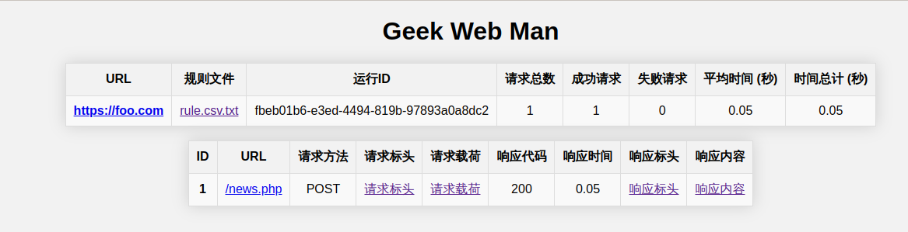

# geek-web-man

极客营Web助手，执行网站性能测试、批量请求URL等任务并生成运行报告

## 规则结构

以模板规则目录 `example/foo.com` 为例：

    ├── charset  <-- 网站编码
    ├── cookie  <-- 网站Cookies（通常在开发者工具中的响应头中可以找到）
    ├── payload  <-- 请求载荷数据存放目录
    │   └── post.json
    ├── report  <-- 运行报告目录
    │   └── https___foo.com  <-- 网站URL
    │       └── fbeb01b6-e3ed-4494-819b-97893a0a8dc2  <-- 运行UUID
    │           ├── 1  <-- 规则编号
    │           │   ├── request_body.txt
    │           │   ├── request_headers.json
    │           │   ├── response_body.txt
    │           │   └── response_headers.json
    │           ├── index.html
    │           └── rule.csv.txt  <-- 规则文件历史记录
    ├── rule.csv  <-- 规则文件
    └── url  <-- 网站URL

## 环境要求

* Python 3.8.0及以上版本

## 安装

    pip3 install geek-web-man

## 使用方法

### 准备运行规则

```bash
mkdir -p var/lib
cp -r example/foo.com var/lib/
```

### 参数设置

请根据需求修改 `var/lib/foo.com` 中的运行参数设置。

### 运行程序

```bash
geek-web-man -d var/lib/foo.com
```

### 运行报告

运行报告会自动保存至规则目录下，如 `var/lib/foo.com/report`：

